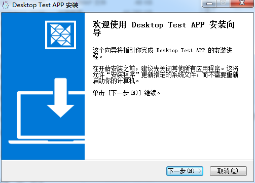
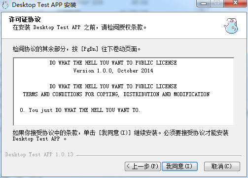
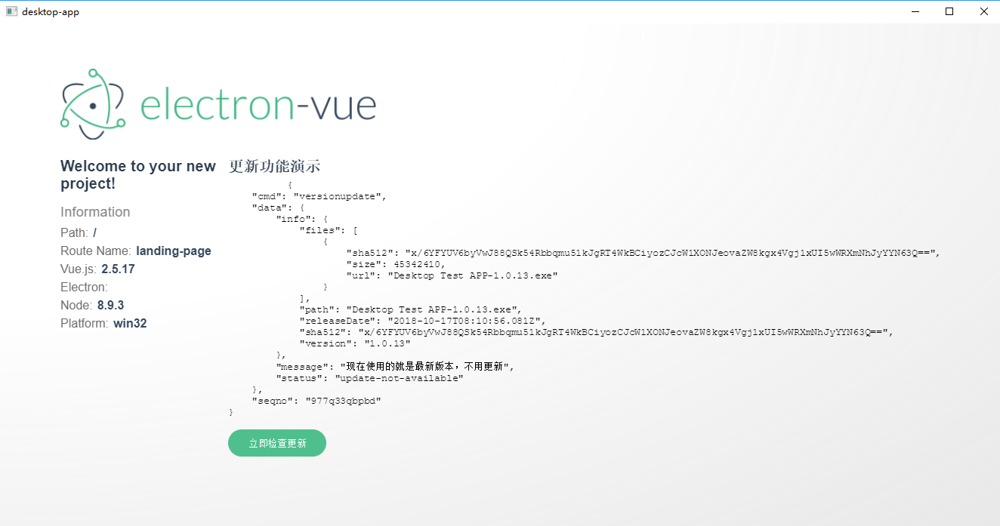

# Electron 脚手架

提供开箱即用的 electron 脚手架，封装底层核心与基础功能，完全只关心您的业务

[查看文档](./docs/readme.md)

### 功能列表

* 路由
* 控制器
* 状态数据管理
* sqlite 数据库持久化存储
* IPC 、http 与 TCP 等统一适配器封装
* 自动更新
* 日志
* renderer 窗口管理
* exe 安装包构建
* 前端 vue 脚手架

### 命令列表

``` sh
# 安装依赖
npm install

npm run build:clean # 构建到已解包的应用到 build 文件夹下
npm run build:arm64 # 构建 arm64 的版本
npm run build:linux # 构建 linux 版本
npm run build:linux32 # 构建 linux x32 版本
npm run build:mac # 构建 mac 安装包
npm run build:win # 构建windows 64bit的 msi、exe 安装包
npm run build:winx32 # 构建windows 32bit的 msi、exe 安装包
npm run dev # 启动开发工具，renderer 使用 dev:renderer，main 使用 dev:main
npm run dev:main # 启动 main 进程开发
npm run dev:renderer # 启动 renderer 进程开发
npm run lint # eslint 代码风格检测
npm run lint:fix # eslint 代码风格检测，并执行自动修复风格
npm run pack # webpack 构建main和renderer代码
npm run pack:main # webpack 构建 main 进程代码
npm run pack:renderer # webpack 构建 renderer 进程代码

```

### 快速开始

* 安装依赖 `npm install`
* 启动开发 `npm run dev`

### 致谢

本脚手架基于 electron-vue 生成，感谢提供基础框架

### screenshot



